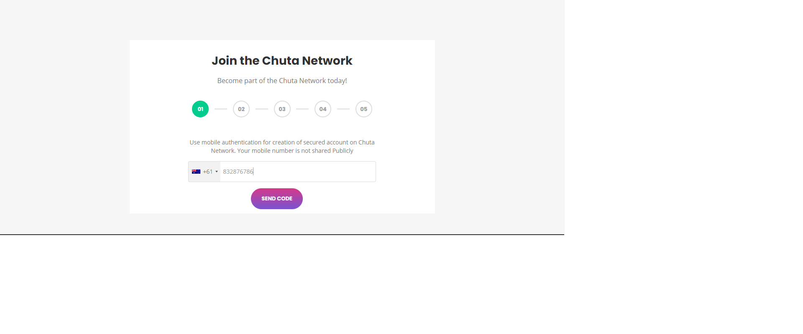
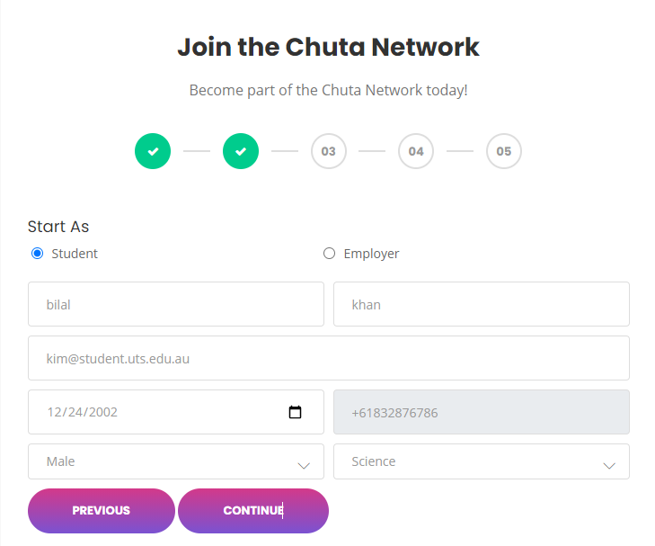

# Chuta Network

A Laravel and Vue.js based networking platform connecting students and employers with onboarding workflows, package subscriptions, Stripe payment integration, and employer dashboard management.

---

# Features

- Multi-step onboarding & registration system
- Student & Employer authentication workflow
- Mobile verification integration
- Employer dashboard management
- Package subscription system
- Stripe payment gateway integration
- Responsive dashboard UI
- Payment success workflow
- Package activation handling
- Laravel backend APIs
- Vue.js frontend components

---

# Registration Workflow

## Step 1 — Mobile Verification



---

## Step 2 — User Information



---

## Registration Completed Successfully


---

# Employer Dashboard

.png)

---

# Package Purchase Flow

## Package Listing

.png)

---

## Purchase Confirmation Modal

.png)

---

# Stripe Payment Integration

## Stripe Payment Modal

.png)

---

## Filled Payment Information

.png)

---

## Payment Success Notification

.png)

---

# Tech Stack

## Backend
- Laravel
- PHP
- MySQL
- REST APIs

## Frontend
- Vue.js
- Bootstrap
- jQuery
- HTML5
- CSS3

## Payment Integration
- Stripe Payment Gateway

---

# Project Modules

- User Registration System
- Employer Dashboard
- Student Dashboard
- Package Subscription System
- Stripe Payment Processing
- Authentication & Authorization
- Mobile Verification Workflow

---

# Setup Instructions

## Clone Repository

```bash
git clone https://github.com/bilalazhar18/chuta-network.git
```

---

## Navigate To Project

```bash
cd chuta-network
```

---

## Install Backend Dependencies

```bash
composer install
```

---

## Install Frontend Dependencies

```bash
npm install
```

---

## Environment Setup

```bash
cp .env.example .env
```

---

## Generate Application Key

```bash
php artisan key:generate
```

---

## Run Database Migration

```bash
php artisan migrate
```

---

## Compile Frontend Assets

```bash
npm run dev
```

---

## Start Laravel Server

```bash
php artisan serve
```

---

# Frontend Architecture

Frontend UI components and interactive workflows are developed using Vue.js integrated with Laravel Blade templates for dynamic rendering and better user experience.

---

# Author

Bilal Azhar

GitHub:
https://github.com/bilalazhar18
